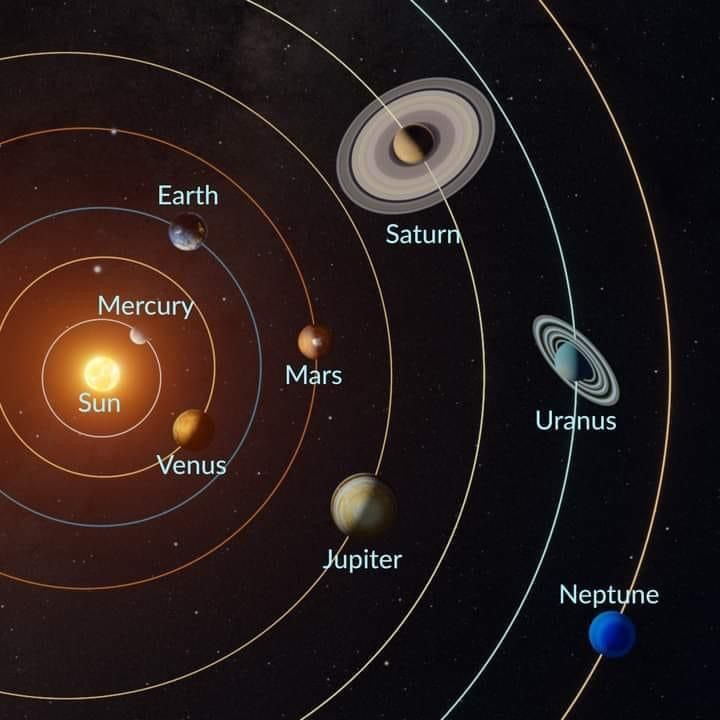
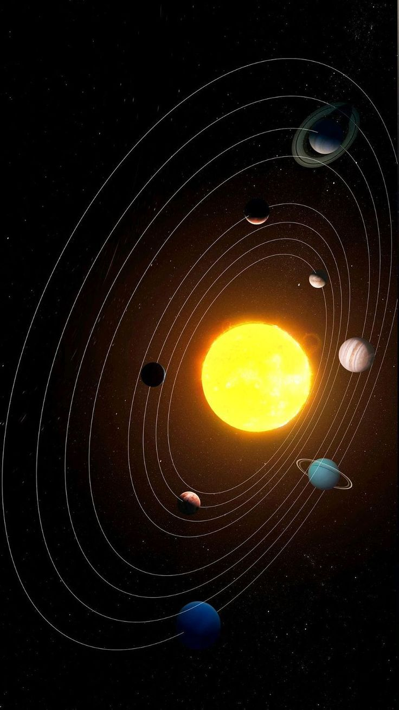

---

Planets in Our Solar System

As in the beginning days of human existence, curiosity has always driven us to explore the unknown. Ancient civilizations once believed the Earth was a flat disc at the center of creation, with everything revolving around it. This geocentric worldview reflected humanity’s sense of being one of a kind. Over many years, discoveries have reshaped our understanding of the Earth, the solar system, and our place in the universe.

Our solar system consists of eight planets, one star, several dwarf planets, asteroids, comets, and interstellar dust, and it formed about 4.6 billion years ago [1,2,8]. It was formed from a dense cloud of gas and dust that was initiated by a close nearby supernova. The collapse of this cloud formed a spinning solar nebula. At the center, gravity initiated nuclear fusion, which gave birth to our star, the Sun, which is made up of 99% of the system’s matter [1]. The material that was left gave rise to planets, moons, and smaller bodies. Rocky planets formed close to the Sun, while gas giants formed farther away, where ices could condense. Jupiter’s strong gravity stopped some material from creating other planets, which this material made the asteroid belt [10]. 

Humanity’s models of the solar system reflect our growing knowledge. The geocentric model, developed by Ptolemy around 150 CE, placed Earth at the center and explained retrograde motion using “epicycles.” In 1543, Nicolaus Copernicus introduced the heliocentric model, proposing that the Sun, not Earth, was central [3]. While revolutionary, it still assumed circular orbits. Johannes Kepler improved this in 1609, showing that planets move in ellipses and formulating his three laws of planetary motion [4,12]. Finally, Isaac Newton’s gravitational model in 1687 provided the physical explanation, identifying gravity as the force maintaining planetary orbits [5]. These successive models illustrate humanity’s growing ability to explain celestial phenomena with increasing accuracy.  

Processes within the solar system continue to shape its evolution. Asteroids and comets travel in space, sometimes smashing into planets or breaking apart. Moons orbit their planets, influenced by tidal forces that drive volcanic activity or ocean tides. The Kuiper Belt and Oort Cloud store icy bodies that occasionally send comets inward [10]. The solar wind streams outward from the Sun, interacting with planetary magnetic fields and atmospheres. Gravity governs all motion, ensuring orbital stability, while collisions and impacts reshape planetary surfaces, leaving craters and altering geology.  

Planet Composition Table

| Planet   | Main Elements | Core Composition | Atmosphere Composition |
|-----------|----------------|------------------|------------------------|
| **Mercury** | ~70% metal (iron, nickel), ~30% silicate rock | Large iron core (~40% of volume) | Very thin exosphere (oxygen, sodium, hydrogen, helium, potassium) |
| **Venus** | Iron core, silicate mantle/crust | Iron + rock | 96% CO₂, 3.5% N₂, trace sulfur dioxide |
| **Earth** | Iron (core), silicates (mantle/crust) | Iron + nickel core | 78% N₂, 21% O₂, trace CO₂, argon |
| **Mars** | Iron, nickel, silicates | Iron + silicate mantle | 95% CO₂, 2.7% N₂, 1.6% Ar |
| **Jupiter** | ~75% hydrogen, ~25% helium | Rock/metal/ice core | Hydrogen, helium, methane, ammonia, water vapor |
| **Saturn** | ~75% hydrogen, ~25% helium | Rock/metal/ice core | Hydrogen, helium, methane, ammonia |
| **Uranus** | Hydrogen, helium, water, methane, ammonia | Rock/metal/ice core | Hydrogen, helium, methane (gives blue color) |
| **Neptune** | Hydrogen, helium, water, methane, ammonia | Rock/metal/ice core | Hydrogen, helium, methane (blue color) |

Life is said to have formed only on Earth four billion years ago. Molecules such as water, methane, and ammonia fused under energy coming from lightning and sunlight, which produced amino acids and nucleotides that make up proteins and DNA [9,11]. In Earth’s oceans, these molecules created a “primordial soup,” combining into sophisticated structures. Lipid membranes enclosed them, forming protocells that can maintain internal chemistry. RNA and DNA allowed for replication and storage of genetic material. Natural selection favored stable, self-replicating cells, which developed into complicated organisms [9,11]. While Mars, Europa, and Enceladus may have had good conditions, Earth remains the only confirmed planet with life on it [8].  

Evidence for the spherical nature of planets goes back to ancient Greek thinkers. Aristotle observed Earth’s curved shadow on the Moon during eclipses [6]. Sailors noted ships disappearing hull-first over the horizon, demonstrating Earth’s curvature. Galileo’s telescope revealed round disks of planets and moons [7], while Newton’s theory of gravity explained why large bodies naturally form spheres [5]. Later, circumnavigation and satellite orbits confirmed planetary curvature beyond doubt.  

As more discoveries are made, our understanding of the solar system deepens. The knowledge we have gained has even allowed humanity to send spacecraft and even humans to the Moon. Each breakthrough brings us closer to fully understanding the processes governing our solar system. Yet the solar system is only one of many systems within the Milky Way Galaxy, itself just one galaxy among billions. Every star in the night sky represents a potential planetary system, and beyond them lies the vast universe. The things we have uncovered so far are only the tip of the iceberg of the many mysteries waiting to be uncovered [1,2,8].  

---

Citations (AIP Style)

1. NASA, “Formation of the Solar System,” NASA Science Solar System Exploration (2024).  
2. ESA, “The Solar System and Its Formation,” European Space Agency (2023).  
3. N. Copernicus, On the Revolutions of the Heavenly Spheres (1543).  
4. J. Kepler, Astronomia Nova (1609).  
5. I. Newton, Philosophiæ Naturalis Principia Mathematica (1687).  
6. Aristotle, On the Heavens (350 BCE).  
7. Galileo Galilei, Sidereus Nuncius (1610).  
8. Encyclopaedia Britannica, “Solar System,” Encyclopaedia Britannica Online (2024).  
9. C. Chyba and C. Sagan, “Endogenous production, exogenous delivery and impact-shock synthesis of organic molecules: An inventory for the origins of life,” Nature 355, 125–132 (1992).  
10. D. Jewitt and J. Luu, “The Kuiper Belt and the Primordial Evolution of the Solar System,” Nature 403, 363–366 (2000).  
11. M. J. Russell, A. J. Hall, and W. Martin, “The emergence of life from iron monosulfide bubbles at a submarine hydrothermal redox and pH front,” J. Mol. Evol. 36, 1–9 (1993).  
12. Encyclopaedia Britannica, “Kepler’s Laws of Planetary Motion,” Encyclopaedia Britannica Online (2024).  

---

Bibliography (AIP Style)

[1] NASA, “Formation of the Solar System,” NASA Science Solar System Exploration (2024).  
[2] ESA, “The Solar System and Its Formation,” European Space Agency (2023).  
[3] N. Copernicus, On the Revolutions of the Heavenly Spheres (1543).  
[4] J. Kepler, Astronomia Nova (1609).  
[5] I. Newton, Philosophiæ Naturalis Principia Mathematica (1687).  
[6] Aristotle, On the Heavens (350 BCE).  
[7] Galileo Galilei, Sidereus Nuncius (1610).  
[8] Encyclopaedia Britannica, “Solar System,” Encyclopaedia Britannica Online (2024).  
[9] C. Chyba and C. Sagan, “Endogenous production, exogenous delivery and impact-shock synthesis of organic molecules: An inventory for the origins of life,” Nature 355, 125–132 (1992).  
[10] D. Jewitt and J. Luu, “The Kuiper Belt and the Primordial Evolution of the Solar System,” Nature 403, 363–366 (2000).  
[11] M. J. Russell, A. J. Hall, and W. Martin, “The emergence of life from iron monosulfide bubbles at a submarine hydrothermal redox and pH front,” J. Mol. Evol. 36, 1–9 (1993).  
[12] Encyclopaedia Britannica, “Kepler’s Laws of Planetary Motion,” Encyclopaedia Britannica Online (2024).  
 
